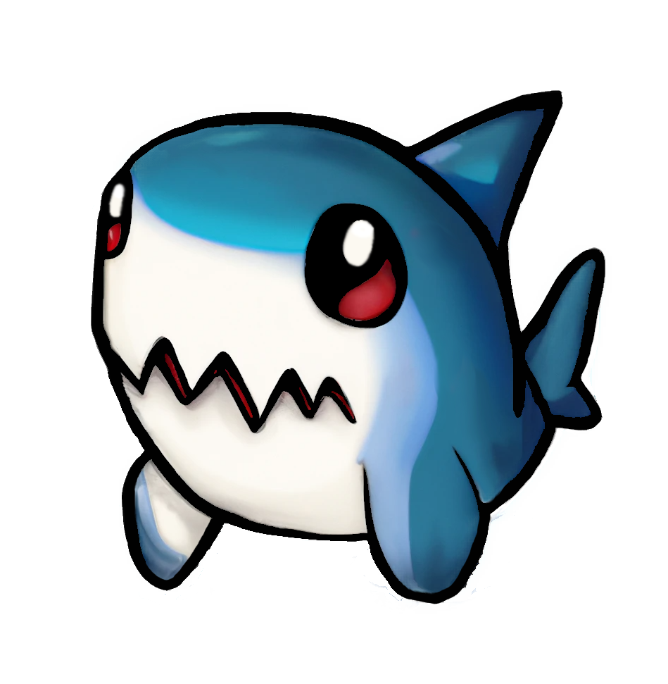

# 🦈 bwomp

<!-- Put .github/assets/bwomp.png image here  -->
<!--


a petite framework built on top of fastify -->

<div align="center">
	
	<p>a petite and mutable framework built on top of fastify</p>
</div>

# 📚 examples

```ts
import { bwomp, get, post } from 'bwomp';

const ping = get()
	.identify('ping') // used for logging; optional
	.handle(({ reply }) => ({ message: 'pong', status: 200 }));

const welcome = post()
	.identify('welcome')
	.body({ name: 'string' }) // wip
	.handle(({ reply, data: { body } }) => ({ message: `${body.name}`, status: 200 }));

await bwomp() //
	.route('/api/v1', ping, welcome)
	.bite(3000);
```
